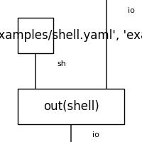

# Shell examples

## Hello world!

```
$ python -m mytilus examples/hello-world.yaml
Hello world!
```


## Script

```
$ python -m mytilus examples/shell.yaml
73
23
  ? !grep grep: !wc -c
  ? !tail -2
```




# Working with the CLI
Open terminal and run `mytilus` to start an interactive session. The program `bin/yaml/shell.yaml` prompts for one command per line, so when we hit `↵ Enter` it is evaluated. When hitting `⌁ Ctrl+D` the environment exits.

```yaml
--- !bin/yaml/shell.yaml
!echo Hello world!
Hello world!
```

Escaped ASCII newlines can encode multiline commands in one REPL entry:

```yaml
!echo\n? foo\n? bar\n
foo bar
```

# Other examples

## React
The first example in https://react.dev/ in diagrammatic style.


## Sweet expressions
`fibfast` function from https://wiki.c2.com/?SweetExpressions.


## Rosetta code

* https://rosettacode.org
* [rosetta](rosetta) examples directory
